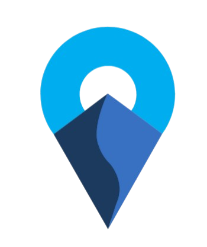

#  SyncRoute — AI-Powered Collaborative Trip Planner

> **Plan together. Travel smarter.**

[](<!-- DEPLOY_LINK_HERE -->)

SyncRoute is a **real-time collaborative trip planning platform** powered by an AI travel assistant called **@Safar**. It combines group chat, intelligent itinerary generation, live disruption alerts, and an immersive satellite map preview — all in one sleek, modern interface.

---

## ✨ Features

### 🤖 AI Travel Assistant — @Safar
- Chat with **@Safar** to generate full multi-day itineraries in seconds
- Context-aware suggestions based on trip vibe, budget, and group preferences
- Smart mentions: `@budget`, `@delay`, `@optimize`, `@update` for specialized queries
- Streaming AI responses with typing indicators

### 👥 Real-Time Collaboration
- Create trips and invite collaborators via username
- Live group chat with presence indicators and typing status
- Real-time synced itineraries powered by **Supabase Realtime**
- Workspace DM with Safar for personal planning

### 🗺️ AI Itinerary Engine
- Auto-generated day-by-day itineraries with time, cost, distance, and activity details
- Drag-and-drop reordering of activities
- Inline editing of itinerary items
- One-click PDF/text export of the full trip plan

### 🌍 Immersive Virtual Tour
- **Satellite Earth View** — High-res Esri satellite imagery with fly-to animations
- **Dark Map Mode** — Sleek vector map toggle for a clean, modern look
- Interactive route polylines connecting all stops with numbered markers
- Floating glassmorphic itinerary panel + context card with AI vibe ratings
- Click any stop on the map or sidebar to smoothly fly there

### ⚡ Live Disruption Alerts
- Real-time weather and disruption monitoring for trip destinations
- AI-powered replanning when disruptions are detected
- Visual alert badges on affected itinerary items

### 🎨 Premium Design System
- Dark/light mode with smooth transitions
- Glassmorphism, micro-animations, and gradient accents
- Custom fonts (Poppins, Bebas Neue) with polished typography
- Fully responsive layout

---

## 🛠️ Tech Stack

| Layer | Technology |
|-------|-----------|
| **Framework** | [Next.js 16](https://nextjs.org/) (App Router) |
| **Language** | TypeScript |
| **Styling** | Tailwind CSS v4 |
| **UI Components** | shadcn/ui + Radix UI |
| **Animations** | Framer Motion |
| **Icons** | Lucide React |
| **Backend / Auth / DB** | [Supabase](https://supabase.com/) (PostgreSQL, Auth, Realtime) |
| **Maps** | Leaflet + Esri World Imagery tiles |
| **AI** | Google Gemini API (via API routes) |
| **PDF Export** | jsPDF |
| **Notifications** | react-hot-toast |

---

## 📁 Project Structure

```
src/
├── app/
│   ├── page.tsx                  # Landing page
│   ├── layout.tsx                # Root layout + theme provider
│   ├── globals.css               # Design tokens + custom animations
│   ├── dashboard/
│   │   └── page.tsx              # Main collaborative dashboard
│   ├── immersive-preview/
│   │   └── page.tsx              # Satellite map virtual tour
│   ├── onboarding/
│   │   └── page.tsx              # User onboarding flow
│   └── api/
│       ├── safar/                # AI chat endpoint
│       ├── safar-itinerary/      # AI itinerary generation
│       └── generate-pdf/         # PDF export endpoint
├── components/
│   ├── auth-buttons.tsx          # Auth modal (login/signup/forgot)
│   ├── mode-toggle.tsx           # Dark/light theme switch
│   ├── theme-provider.tsx        # next-themes wrapper
│   └── ui/                      # shadcn/ui primitives
├── hooks/
│   ├── useSyncRoute.ts           # Chat, trips, users, invitations
│   └── useItinerary.ts           # Itinerary CRUD + AI generation
├── services/
│   └── ...                       # External service integrations
└── lib/
    ├── supabase.ts               # Supabase client
    └── utils.ts                  # Utility functions
```

---

## 🚀 Getting Started

### Prerequisites

- **Node.js** ≥ 20
- **npm** ≥ 9
- A [Supabase](https://supabase.com/) project (free tier works)
- A [Google AI / Gemini API key](https://aistudio.google.com/apikey) (for @Safar)

### 1. Clone the repository

```bash
git clone https://github.com/<your-username>/syncroute.git
cd syncroute
```

### 2. Install dependencies

```bash
npm install
```

### 3. Configure environment variables

Create a `.env.local` file in the root directory:

```env
NEXT_PUBLIC_SUPABASE_URL=https://your-project.supabase.co
NEXT_PUBLIC_SUPABASE_ANON_KEY=your-supabase-anon-key
GOOGLE_API_KEY=your-gemini-api-key
NEXT_PUBLIC_GOOGLE_MAPS_KEY=your-google-maps-key  # Optional, for Street View thumbnails
```

> **Note:** The satellite map uses free Esri tiles and works without any API key. The Google Maps key is only needed for Street View thumbnail images in the context card.

### 4. Set up Supabase

Your Supabase project needs the following tables:

- `users` — id, username, email, avatar_color, preferences
- `trips` — id, name, vibe, theme_color, is_workspace, created_by
- `trip_members` — trip_id, user_id, role
- `messages` — id, trip_id, user_id, content, type, timestamp
- `itinerary_days` — id, trip_id, day_number, title, data
- `invitations` — id, trip_id, inviter_id, invitee_username, status

Enable **Realtime** on the `messages`, `trips`, and `itinerary_days` tables.

### 5. Run the development server

```bash
npm run dev
```

Open [http://localhost:3000](http://localhost:3000) in your browser.

---

## 🌐 Deployment

The app is deployed at:

> 🔗 **[<!-- DEPLOY_LINK_HERE -->](<!-- DEPLOY_LINK_HERE -->)**

To deploy your own instance:

```bash
npm run build
npm run start
```

Or deploy to [Vercel](https://vercel.com/) with one click — just connect your repository and add the environment variables.

---

## 📸 Screenshots

| Landing Page | Dashboard | Immersive Virtual Tour |
|:---:|:---:|:---:|
| Dark/light hero with CTA | AI chat + itinerary sidebar | Satellite fly-to with route |

---

## 👥 Team

<!-- Add your team members here -->

| Name | Role |
|------|------|
| | |
| | |
| | |

---

## 📄 License

This project is built for **SPIT Hackathon 2026**. All rights reserved.

---

<p align="center">
  <sub>Built with ❤️ using Next.js, Supabase & Google Gemini</sub>
</p>
